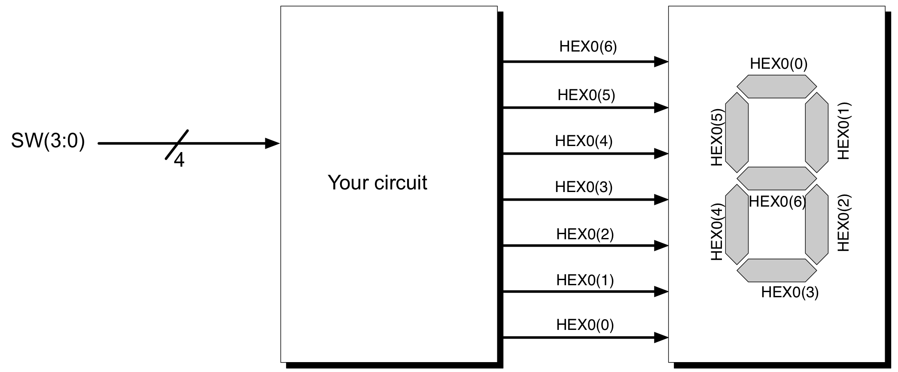
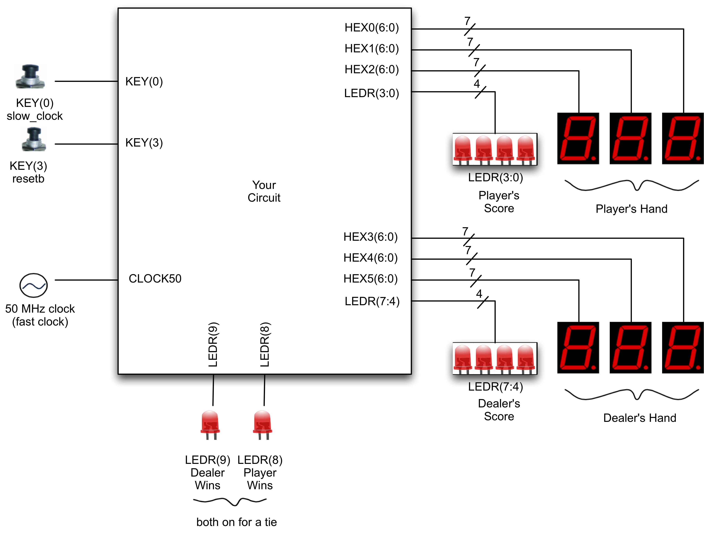
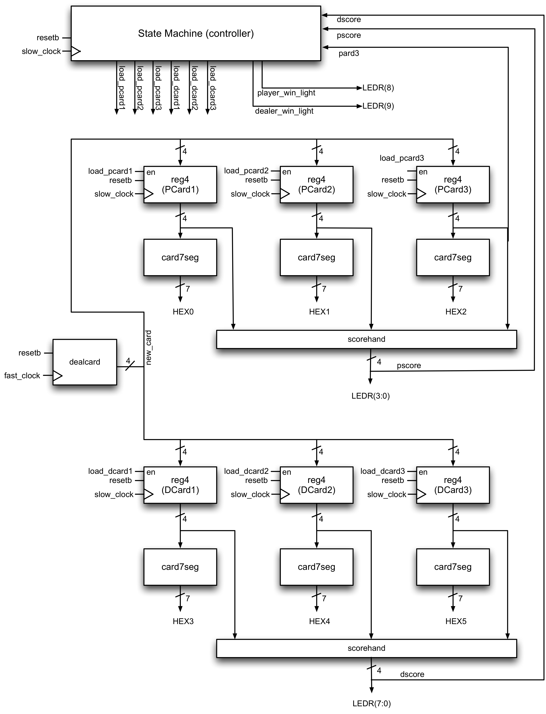

# Lab 1: Simple Datapath and Controller: Baccarat

## Contents

* [Introduction](#introduction)
* [Phase 1: Getting your environment ready](#phase-1-getting-your-environment-ready)
* [Phase 2: Warmup](#phase-2-warmup)
  * [Task 1: A seven\-segment LED driver](#task-1-a-seven-segment-led-driver)
* [Phase 3: Baccarat\!](#phase-3-baccarat)
  * [Task 2: Learn how to play Baccarat](#task-2-learn-how-to-play-baccarat)
    * [Rules](#rules)
    * [Score](#score)
  * [Task 3: Understand the overall functionality your circuit should implement](#task-3-understand-the-overall-functionality-your-circuit-should-implement)
  * [Task 4: Understand the components of our circuit](#task-4-understand-the-components-of-our-circuit)
    * [dealcard](#dealcard)
    * [reg4](#reg4)
    * [card7seg](#card7seg)
    * [scorehand](#scorehand)
    * [statemachine](#statemachine)
  * [Task 5: Verilog code and testbenches](#task-5-verilog-code-and-testbenches)
  * [Task 6: Demo your design on a DE1\-SoC board](#task-6-demo-your-design-on-a-de1-soc-board)
  * [Task 7: Challenge task](#task-7-challenge-task)
* [Deliverables and Evaluation](#deliverables-and-evaluation)

## Introduction

In this lab, you will become familiar with the software and hardware we will be using in the labs, and use the hardware and software to implement a simple digital datapath.

We will be using two pieces of software for most of this course: Quartus Prime, which is produced by Intel, and ModelSim, which is produced by Mentor Graphics. There are several versions of ModelSim available; we will be using one that is distributed with Quartus. You can download these programs (we use the free Lite version), or use them on the departmental computers in the lab.

Like all labs in the summer version of this course, this lab will span one week only. If you want to be able to finish the lab before the following Friday, you need to get started right away. TAs will be available on Piazza to help you if you run into problems. The lab sessions on Fridays are primarily for marking. You almost certainly will not finish the lab if you don’t start right away.

The end result of this lab will be a Baccarat engine. Baccarat is a card game played in casinos around the world. Baccarat is for “high rollers” — James Bond is a fan of Baccarat (and, for some odd reason, martinis made with cheap vodka). Designing this Baccarat engine will help you understand how a simple datapath can be constructed and controlled by a state machine; this is the foundation of all large digital circuits. 

It may be tempting to write a software-like specification and hope that the synthesis tools can synthesize the design to hardware. It is unlikely that this approach would be successful. In this document, we will consider the circuit at the low-level hardware level, to ensure that you understand how the hardware works. This handout will take you through the steps needed to construct the circuit, starting from the basic blocks, and ending in a working circuit on your Altera board.

## Phase 1: Getting your environment ready

Complete the design flow tutorial, distributed as Assignment 0. There are no deliverables for this task.

## Phase 2: Warmup

To get you started quickly, in this Phase, you will create the simplest interesting combinational circuit I can think of. It will also be a component in the Baccarat game that you will create in Phase 3.

You will design a combinational block with four inputs and seven outputs:

In this phase, the four inputs will be connected to switches 3 to 0 on your board, and the seven outputs are connected to a single seven-segment display on your board.

The circuit operates as follows. The four inputs can be interpreted as representing a number between 0 and 15. Each number between 1 and 13 represents a specific card value in a deck of cards, as follows: Ace=1, number cards are represented as themselves, Jack=11, Queen=12, King=13. An input of 0 represents “no card” and input values of 14 and 15 will not be used; for the purposes of this Phase, you should display a blank if they do occur.

The output is a set of values that will display the value of the card on the seven segment display:

Each segment in the display is controlled by one of the `HEX` output lines. Note that the lines driving the seven-segment display are active-low — that means that a 0 turns the segment **on** and a 1 turns the segment **off** (this is the opposite of what you might expect).

### Task 1: A seven-segment LED driver

Add your code to implement the Verilog stub in the `task1` folder. Create a project in Quartus, import the pin assignments, compile your design, download it to the board, and test your design. Remember to download the correct pin assignment file for the board you are using.

Write a module with unit tests for the LED driver in `tb_card7seg.sv`. Your testbech module will be named `tb_card7seg` and will have no ports. This means it will need to instantiate `card7seg.sv`, as well as and drive any clock(s) in the design using the Verilog delay syntax (`#`). Be sure that your testbench covers **all cases**, even those for which the display is blank. You may use waveforms or text output (such as `$display`) to check whether your testbench works; we only care that it exercises the entire design under test.

In fact, we strongly recommend writing the testbench **before** you start implementing the block in Verilog. This will force you to go through the specification carefully and make sure you really understand it, and will avoid leaking hidden assumptions from your design into your tests. Plus, it's very satisfying to finish your code and see that it passes all your tests!

## Phase 3: Baccarat!

### Task 2: Learn how to play Baccarat

The game of Baccarat is simple. There are various versions, but we will focus on the simplest, called Punto Banco, which is played in Las Vegas and Macau. The following text will describe the algorithm in sufficient detail for completing this lab; if you need clarification or more information on any point, there are numerous tutorials on the web (Google is, as always, your friend).

#### Rules

- Two cards are dealt to both the player and the dealer face up (first card to the player, second card to dealer, third card to the player, fourth card to the dealer).
- The score of each hand is computed as described under _Score_ below.
- If the player’s or dealer’s hand has a score of 8 or 9, the game is over (this is called a “natural”) and whoever has the higher score wins (if the scores are the same, it is a tie)
- Otherwise, if the player’s score from his/her first two cards was 0 to 5:
  - the player gets a third card
  - the banker may get a third card depending on the following rule:
    1. If the banker’s score from the first two cards is 7, the banker does not take another card
    1. If the banker’s score from the first two cards is 6, the banker gets a third card if the face value of the player’s third card was a 6 or 7
	1. If the banker’s score from the first two cards is 5, the banker gets a third card if the face value of the player’s third card was 4, 5, 6, or 7
    1. If the banker’s score from the first two cards is 4, the banker gets a third card if the face value of player’s third card was 2, 3, 4, 5, 6, or 7
    1. If the banker’s score from the first two cards is 3, the banker gets a third card if the face value of player’s third card was anything but an 8
	1. If the banker’s score from the first two cards is 0, 1, or 2, the banker gets a third card.
- Otherwise, if the player’s score from his/her first two cards was 6 or 7:
  - the player does _not_ get a third card
  - if the banker’s score from his/her first two cards was 0 to 5:
    - the banker gets a third card
  - otherwise the banker does not get a third card
- The game is over. Scores are computed as below. Whoever has the higher score wins, or if they are the same, it is a tie.

#### Score

The score of each hand is computed as follows:

- The value of each card in each hand is determined. Each Ace, 2, 3, 4, 5, 6, 7, 8, and 9 has a value equal the face value (eg. Ace has value of 1, 2 is a value of 2, 3 has a value of 3, etc.). Tens, Jacks, Queens, and Kings have a value of 0.
- The score for each hand (which can contain up to three cards) is then computed by summing the values of each card in the hand, and the rightmost digit (in base 10) of the sum is the score of the hand. In other words, if Value1 to Value 3 are the values of Card 1 to 3, then

  Score of hand = (Value1 + Value2 + Value3) mod 10

  If the hand has only two cards, then Value3 is 0. You should be able to see that the score of a hand is always in the range [0,9].

It is interesting to note that in this version of the game, all moves are automatic (the player does not have to make any decisions!). The version played in Monte Carlo is slightly different, in that a player can choose whether or not to take a third card. We will not consider that here.

### Task 3: Understand the overall functionality your circuit should implement

First, consider the behaviour of the Baccarat circuit from the user’s point of view. As shown in the figure below, the circuit is connected to two input keys, a 50MHz clock, and the output of the circuit drives six seven-segment LEDs and ten lights. 

The game starts by asserting the reset signal (KEY3) which is **active-low**. The user can then step through each step of the game (deal one card to the player, one to the dealer, etc) by pressing KEY0 (this will be referred as **slow_clock** in this document). The exact sequence of states will be described below. As the cards are dealt, the player’s hand is shown on HEX0 to HEX2 (one hex digit per card — remember each hand can contain up to three cards) and the dealer’s hand is shown on HEX3 to HEX5. The current score of the player’s hand will be shown on lights LEGR3 to LEGR0 (recall that the score of a hand is always in the range [0,9] and can be represented using four bits), and the current score of the dealer’s hand will be shown on LEGR7 to LEGR4. We use lights to display the binary version of the score, since the DE1-SoC only has six hex digits.

There is also a 50MHz clock input; this is used solely for clocking the dealcard block which deals a random card. This will be described further in a subsequent task.

At the end of the game, red lights 8 and 9 will indicate the winner: if the player wins, light LEDR(8) goes high. (In your implementation, you may delay this until KEY0 has been pressed one more time after the winning card has been dealt). If the dealer wins, light LEDR(9) goes high. If it is a tie, both LEDR(8) and LEDR(9) go high. The system then does nothing until the user presses reset, sending it back to the first state to deal another hand.

Notice that, other than cycling through the states using KEY0 (the slow clock), the user does not need to do anything. This is consistent with the description of the game above.

### Task 4: Understand the components of our circuit:

The circuit consists of two parts: a state machine and a datapath. The datapath does all the “heavy lifting” (in this case, keeping track of each hand and computing the score for each hand) and the state machine controls the datapath (in this case, telling the datapath when to load a new card into either the player’s or dealer’s hand). The overall block diagram is shown below.

 

First consider the datapath, which consists of everything except the `statemachine` block in the block diagram. There are a number of subcircuits here, and each will be described below:

#### dealcard

To deal random cards, we need a random number generator. Random numbers are difficult to generate in hardware (can you suggest why?). We will use a few simple tricks. First, assume we are dealing from an infinite deck, so it is equally likely to generate any card, no matter which cards have been given out (casinos try to approximate this approach this by using multiple decks). Second, assume that when the player presses the “next step” key, an unpredictable amount of time has passed, representing a random delay. During this random delay interval, the subcircuit described in `dealcard.sv` will be continuously counting from the first card (Ace=1) to the last card (King=13), and then wrapping around to Ace=1 at a very high rate (e.g., 50MHz). To obtain a random card, we simply sample the current value of this counter when the user presses the “next step” key.

To save you time, we have written `dealcard.sv` for you. This block has two inputs (the fast clock and a reset) and one output (the card being dealt, represented by a number from 1 to 13 as described above). This circuit is essentially a counter. Be sure you understand it before moving on. 

The design of `dealcard` raises an interesting point. Because you have two clocks (one from KEY0 driving the modules that use `dealcard` and the other from the 50MHz clock driving `dealcard` itself), you may rarely observe that the card dealt is not in the range 1..13. This is because the two clocks are _asynchronous_ — i.e., you might push KEY0 at just the right moment to sample the `dealcard` output when it is unstable. Can you reproduce this behaviour when testing in the FPGA?

You do not need to worry the asynchronous clocks for this lab, other than noticing when it happens. We will learn how to safely deal with multiple clock domains and asynchronous circuits later in the course.

#### reg4

Each card in each hand is stored in a `reg4` block, which is a 4-bit wide register (set of four D-flip-flops). The upper three reg4 blocks store the player’s hand, and the lower three `reg4` blocks store the dealer’s hand (recall each hand can have up to three cards). Each card is stored as a number from 1 to 13 (Ace=1, number cards are represented as themselves, Jack=11, Queen=12, King=13). We will not store the suit information for each card (the suit of a card does not matter in Baccarat). If a position in the hand does not have a card, we store a 0 to represent “no card”. As an example, if the player’s hand consists of a 5 and a Jack (and no third card), `PCard1` would contain the number 5, `PCard2` would contain the number 11, and `PCard3` would contain the number 0 (no card). Note that since there are 14 different possible values (including 0), four bits in each register is sufficient.

Each register is clocked using slow_clock (which is connected to KEY0 and toggled by the user). On each rising clock edge of slow_clock, if the enable signal (for `PCard1` the enable signal is called `load_pcard1`) is high, the value from dealcard is loaded into the register. The register also contains an active-low reset signal (which is connected to KEY3); when this is low, the value in the register goes to 0.

#### card7seg

This is the block you wrote in Phase 2. As you recall, this is a simple combinational circuit with a single 4-bit input (the value of a card encoded as above) and 7 outputs that drive a HEX according to the following pattern:

- The value 0 is “no card” and should be displayed as a blank (all HEX segments off)
- 1 is displayed as “A”, 10 is displayed as “0”, Jack as “J”, Queen as “q”, and King as “H”
- 2 through 9 are displayed as themselves, making sure the numeral 9 appears differently than “q”

You can use the block from Phase 2 directly; the inputs now come from registers rather than switches.

#### scorehand

This is a simple combinational circuit that takes the value of three cards and computes the score of that hand. Recall that the score of a hand is computed as follows: 

1. The value of each of the three cards in each hand is determined. Each Ace, 2, 3, 4, 5, 6, 7, 8, and 9 has a value equal the face value (eg. Ace has value of 1, 2 is a value of 2, 3 has a value of 3, etc.). Tens, Jacks, Queens, and Kings have a value of 0. If fewer that three cards are in the hand, the missing positions are 0.
1. The values of the cards in each hand are summed, and the rightmost digit (in base 10) of the sum is the score of the hand. In other words, if Value1 is the value of the first card, Value2 is the value of the second card, and Value3 is the value of the third card, then
   
   Score of hand = (Value1 + Value2 + Value3) mod 10

You should be able to see that a hand can have a score in the range [0,9], thus 4 bits are sufficient for the output of this block.

#### statemachine

The state machine is the “brain” of our circuit. It has an active-low reset (called resetb) and is clocked by slow_clock (which is connected to KEY0). On each rising edge of slow_clock, the state machine advances one step through the algorithm, and asserts the appropriate control signals at each step. In this circuit, the control signals that the state machine controls are load_pcard1, load_pcard2, … load_dcard3. When it is time to deal the first card to the player, the state machine asserts load_pcard1, which as was described above, causes the first Reg4 block to load in a card (from the output of the dealcard block). During the cycle in which load_pcard1 is 1, all other load_pcard and load_dcard signals are 0, so that no other positions in either hand are updated. As the algorithm progresses, the state machine will generate the other control signals to be asserted at the appropriate times.

As should be evident from the earlier discussion, the card drawing pattern depends on the dealer score and the player score (these are used to determine whether a third card is necessary) as well as the player’s third card (this is used to determine whether the dealer should receive a third card, as described in the rules). Therefore, pcard3, pscore, and dscore are inputs to the state machine.

### Task 5: Verilog code and testbenches

In this task, you will create the testbenches and implement the design in Verilog. Your design must follow the hierarchical design approach shown below:

 

To get you started, stubs for each of the files are in the `task5` folder. Be sure to start with these, so that your interfaces for each module are correct. The `reg4` block is not shown in the diagram; you can either create a new module to describe a four-bit register, or write it directly into `datapath.sv` (your choice, either will work). To help you, we are giving you `dealcard.sv` and `lab1.sv`.

Start by writing unit tests for all your modules (you don't need to test `dealcard`, `card7seg`, or `reg4`). Each `tb_*.sv` file should test the corresponding module by providing inputs to the module's ports and examining the outputs, and test all of the code in the module. This also applies to the testbench for the toplevel module `lab1`, which should only interface with the `lab1` module and should not include the unit testbenches.

The hardest part of this lab is getting the state machine right. We strongly urge you to draw (on paper) a bubble diagram showing the states, the transitions, and outputs of each transition. You are strongly urged to make sure you have your state machine bubble diagram done by the end of your Working Week lab. If you are unclear how to do this, be sure to discuss with your TA during the lab period. When drawing your diagram for your state machine, make sure that you cover all of the possible input conditions.

### Task 6: Demo your design on a DE1-SoC board

Test your design by downloading it to the board and demo the working circuit to the TA. Remember that you should treat your TA as a client, and it is up to you to come up with an appropriate demo that shows that your design works. The TA will ask questions to gauge your understanding of the lab.

Remember to **commit** and **push** your .sv files to GitHub **before the deadline**. If you forget this, you will receive 0 marks for the lab. If your design works, you do not need to demo the datapath and state machine separately, just the entire design. However, if you are unable to get a working design, you should prepare to demo as many subunits on the DE1-SoC board as possible to the TA.

### Task 7: Challenge task

Challenge tasks are tasks that you should only perform if you have extra time, are keen, and want to show off a little bit. If you don’t complete and demo the challenge task, the maximum score you can get on this lab is 9/10.

As described earlier, in casinos, you can bet money that the player will win, the dealer will win, or the two will tie. Modify your design so that the user can place bets, and win or lose money. The user should be able to specify the amount of the bet, and the type of bet (dealer win, dealer loose, or tie). The circuit should keep track of the money the player has, calculate and add the payoff if the player wins, and charges the player’s balance if the player looses (you can look up payoff rates on-line). Since your board has a limited number of lights and switches, you will have to make judicious use of your I/O (you can think of the best way to do this).

## Deliverables and Evaluation

### Using GitHub

To complete your lab, you will need to

1. Clone this git repository (use `git clone`)
1. Modify the relevant files to complete each task
1. Add the files to commit (use `git add`)
1. Commit the files to your local copy of the repository (use `git commit`)
1. Push your copy of the repository to GitHub (use `git push`) and verify that your changes are reflected in the GitHub web interface

If you prefer, you may use the GitHub Desktop interface or another GUI instead of the command-line interface for git.

**WARNING: If you do not push the repository to GitHub, your lab will not be submitted and you will receive 0 marks for this lab.**

You must push your changes **before the deadline**. GitHub will automatically copy the (remote) state of your repository as it appears at the deadline time, and that will be considered your submission.

We strongly encourage you to commit and perhaps push changes as you make progress. This is good development practice — this way, if you mess up and need a previously working version, you can revert your files to a version you committed earlier. To mark your lab, we will only examine the last version commit pushed before the deadline, so don't worry about how messy your in-progress commits might look.

You should commit **only** source files (in this lab, .sv files). You do **not** need to commit synthesis results (e.g., .qof files), waveform dumps, temporary files, and so on.

Any template files we give you (e.g., `card7seg.sv`) should be directly modified and committed, rather than copied and modified.

NOTE: The repository created for you when you follow the assignment link is private by default. **Do not** make it public — that would violate the academic honesty rules for this course.

### Automatic testing

We will be marking your code via an automatic testing infrastructure. Your autograder marks will depend on the fraction of the testcases your code passed (i.e., which features work as specified), and how many cases your testbenches cover.

It is essential that you understand how this works so that you submit the correct files — if our testsuite is unable to compile and test your code, you will not receive marks.

The testsuite evaluates each task separately. For each design task folder (e.g., `task5`), it collects all Verilog files (`*.sv`) that do not begin with `tb_` and compiles them **all together**. Separately, each required `tb_*.sv` file is compiled with the relevant `*.sv` design files. This means that

1. You must not **rename any files** we have provided.
1. Your testbench files must begin with `tb_` and **correspond to design file names** (e.g., `tb_scorecard.sv` for `scorecard.sv`).
1. You must not have **multiple copies of the same module** in separate committed source files in the same task folder. This will cause the compiler to fail because of duplicate module definitions.
1. Your modules must not **rely on files from another folder** (e.g., you will need a separate copy of `card7seg.sv` in the `task5` folder, as well as a separate copies of all relevant files in `task7`). The autograder will only look in the relevant task folder.

The autograder will instantiate and test each module exactly the way it is defined in the provided skeleton files. This means that
1. You must not **alter the module declarations, port lists, etc.**, in the provided skeleton files.
1. You must not **rename any modules, ports, or signals** in the provided skeleton files.
1. You must not **alter the width or polarity of any signal** in the skeleton files (e.g., `resetb` must remain active-low).

(For Task 7, you may add additional ports to the `lab1` module, and change any internal modules as you see fit.)

If your code does not compile and simulate under these conditions (e.g., because of syntax errors, misconnected ports, or missing files), you will receive **0 marks**. If your code does not synthesize using Quartus, your marks will be reduced.

### Marks

The evaluation of your submission consists of two parts:
- the TA demo, worth 30%, and
- the autograder tests of your code and testbenches, worth 70%

(Task 7 is scored differently; see below).

### Task 2 [2 marks]

Deliverables in folder `task1`:

- Modified `card7seg.sv`
- Modified `tb_card7seg.sv`
- Any other modified/added source or test files for your design

### Task 5 [7 marks]

Deliverables in folder `task3`:

- Modified `card7seg.sv`
- Modified `statemachine.sv`
- Modified `scorehand.sv`
- Modified `datapath.sv`
- Modified `tb_statemachine.sv`
- Modified `tb_scorehand.sv`
- Modified `tb_datapath.sv`
- Modified `tb_lab1.sv`
- Any other modified/added source or test files for your design

The toplevel module of your design must be named `lab1`.

### Task 7 [1 mark]

Deliverables in folder `task7`:

- All source files required to implement and test your design

The toplevel module of your design must be named `lab1`, and the main testbench `tb_lab1`. 
We will not autotest this task except to check that your design simulates and that your testbench tests the entire design; therefore, the mark comes 100% from your demo to the TA (unless the submitted simulation files / testbench don't work, in which case you get 0).
